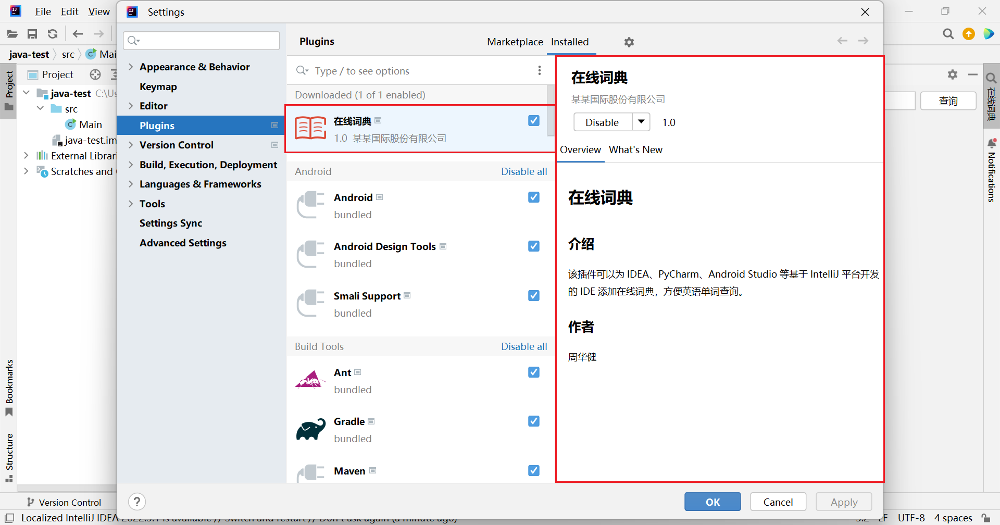

# Java IntelliJ Platform 在线词典插件项目

## 课程介绍

大家常用的 IDEA、PyCharm、PHPStorm、Android Studio 等 IDE，都是基于 IntelliJ Platform 开发的。

本课程将带各位一步一步地基于 IntelliJ Platform 开发一个在线词典插件。

## 项目截图

## 备注

项目代码等内容，在课程资料里面。